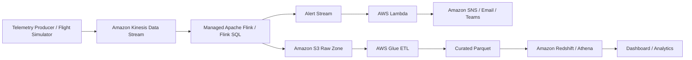

# Flight Stream Anomaly Monitor

An end-to-end portfolio project for an AWS Data Engineer role, modeled after a real-time flight telemetry monitoring use case.

This project demonstrates how to design a streaming data platform that detects inactive flight beams within a rolling 30-minute window, triggers alerts, and stores curated analytics data for downstream reporting.

## Why this project matters

- build real-time pipelines with event-driven architecture
- design scalable AWS-first data engineering solutions
- implement anomaly detection logic for streaming data
- apply data quality checks before analytics consumption
- think in terms of bronze / silver / gold style data flow
- document architecture clearly for production-style systems

## Business problem

In aviation connectivity systems, a flight beam can become inactive or stop sending expected telemetry. If detection depends on batch processing, incident response becomes slow and SLA impact increases.

This project detects inactivity in near real time by ingesting telemetry events, evaluating event gaps over a rolling window, and producing alerts for operations teams.

## Architecture



## Repository structure

```text
flight-stream-anomaly-monitor/
├── .github/workflows/ci.yml
├── docs/
│   └── architecture.md
├── flink/
│   └── inactive_beam_detection.sql
├── infra/terraform/
│   ├── main.tf
│   ├── variables.tf
│   └── outputs.tf
├── sql/
│   ├── redshift_ddl.sql
│   └── analytics_queries.sql
├── src/
│   ├── app.py
│   ├── generator.py
│   ├── quality_checks.py
│   └── simulate_pipeline.py
├── data/
│   └── sample_telemetry.csv
├── requirements.txt
└── README.md
```

## Tech stack

- Python
- SQL
- Apache Flink / Flink SQL
- AWS Kinesis
- AWS Lambda
- AWS SNS
- AWS Glue
- Amazon S3
- Amazon Redshift / Athena
- Terraform
- GitHub Actions

## Project features

- Synthetic flight telemetry generator
- Beam inactivity detection logic
- Sample Flink SQL for rolling-window anomaly detection
- Data quality checks for telemetry records
- Analytics DDL and query examples
- Terraform skeleton for AWS deployment
- Simple local simulation script for GitHub demonstration

## How to run locally

### 1. Create environment

```bash
python -m venv .venv
source .venv/bin/activate
pip install -r requirements.txt
```

### 2. Generate sample telemetry

```bash
python src/generator.py
```

### 3. Run quality checks

```bash
python src/quality_checks.py
```

### 4. Simulate anomaly detection locally

```bash
python src/simulate_pipeline.py
```

### 5. Launch quick dashboard

```bash
streamlit run src/app.py
```

## Next improvements working on

- add Docker support
- add unit tests for inactivity rules
- connect to real Kinesis LocalStack setup
- add dbt models for gold analytics layer
- add Slack or Teams webhook integration

